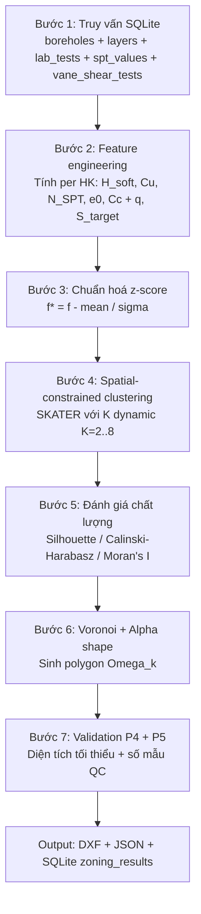
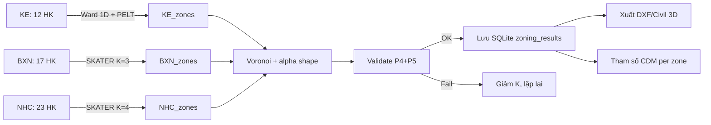

# 55 — Phân vùng gia cố CDM theo tọa độ hố khoan & cọc CDM

**Phiên bản:** 2026-05-25 · Dự án TTHC HCM (Quận 1 / Thủ Thiêm)
**Phạm vi:** 3 khu vực — KE (12 HK kè công viên) · BXN (17 HK CV-HK1..17 bãi xe ngầm) · NHC (23 HK BH-03..BH-44 nhà hành chính)
**Mục tiêu:** Đề xuất nguyên tắc + thuật toán phân vùng gia cố để (1) thiết kế tham số CDM cho từng vùng, (2) tổ chức thi công theo lô, (3) bố trí mẫu QC theo TCVN 9403, (4) trình bày bản vẽ Civil 3D / Revit / DXF.

---

## 1. Đặt vấn đề

### 1.1 Tại sao cần phân vùng?

Dự án TTHC có địa tầng KHÔNG đồng nhất trên cùng một khu vực:

- **KE** (kè công viên): tuyến kè dài ~340 m, $H_{\text{soft}}$ dao động 17–28 m, lớp $\text{XMD}$ chỉ xuất hiện ở một vài HK.
- **BXN** (bãi xe ngầm): khu vực ~100×100 m, 17 HK CV-HK1..17, $H_{\text{soft}}$ trung bình 21,5 m nhưng vùng phía Nam có lớp $1$ dày hơn.
- **NHC** (nhà hành chính): 23 HK rải rác ~250×200 m, $H_{\text{soft}}$ dao động 22–32 m, có chỗ lớp $2$ thay thế lớp $1$.

Nếu thiết kế **một bộ tham số CDM đồng nhất** cho toàn khu vực:

- Vùng địa chất tốt → tốn xi măng dư (lãng phí).
- Vùng địa chất xấu → cọc không đủ chiều dài → lún vượt giới hạn.

Phân vùng cho phép:

$$\text{Thiết kế} = \bigcup_{i=1}^{K} \big( D_i, s_i, qu_i, L_i \big) \text{ tối ưu cho vùng } \Omega_i$$

với $\bigcup \Omega_i = \Omega$ (toàn khu) và $\Omega_i \cap \Omega_j = \emptyset$ (vùng không chồng lên nhau).

### 1.2 Định nghĩa toán học bài toán

**Đầu vào:**
- Tập hố khoan $\mathcal{B} = \{b_1, b_2, \dots, b_n\}$ với mỗi $b_i$ có tọa độ $(x_i, y_i)$ và vector đặc trưng $\mathbf{f}_i \in \mathbb{R}^d$.
- Miền nghiên cứu $\Omega \subset \mathbb{R}^2$ (polygon ngoại biên dự án).

**Đầu ra:**
- Tập polygon $\{\Omega_1, \Omega_2, \dots, \Omega_K\}$ với $\bigcup \Omega_i = \Omega$, $\Omega_i \cap \Omega_j = \emptyset$ ($\forall i \neq j$).
- Mỗi $\Omega_i$ gán cho một **cụm địa chất tương đồng** $c_i$.

**Hàm mục tiêu (tối thiểu):**

$$J = \underbrace{\sum_{i=1}^{K} \sum_{b \in \Omega_i} \| \mathbf{f}_b - \boldsymbol{\mu}_i \|^2_W}_{\text{phương sai trong cụm}} + \lambda \cdot \underbrace{\sum_{(i,j) \in \mathcal{N}} \mathbb{1}[c_i \neq c_j] \cdot d(i,j)^{-1}}_{\text{phạt vi phạm liền kề}}$$

Trong đó:
- $\| \cdot \|_W$ — khoảng cách Mahalanobis (chuẩn hoá theo ma trận hiệp phương sai $W$).
- $\boldsymbol{\mu}_i$ — trung tâm cụm.
- $\mathcal{N}$ — đồ thị liền kề (Delaunay).
- $\lambda$ — trọng số phạt phân vùng "xé lẻ" (không liền khối).

Đây là bài toán **spatial-constrained clustering** — KHÔNG phải clustering thuần tuý vì có ràng buộc không gian.

---

## 2. Bảy Nguyên tắc Phân vùng

| ID | Nguyên tắc | Mục đích | Tham số |
|----|-----------|---------|---------|
| **P1** | Tương đồng địa chất | Cùng vùng → cùng profile đất | $H_{\text{soft}}$, $\bar{C_u}$, $\bar{N}_{SPT}$, $\bar{e_0}$, $\bar{C_c}$ |
| **P2** | Liền kề không gian | Vùng phải liền khối, không xé lẻ | $(x, y)$, đồ thị Delaunay |
| **P3** | Tương đồng tải/lún | Cùng vùng → cùng $q$ và $S_{\text{target}}$ | $q$ (kPa), $S_{\text{target}}$ (cm) |
| **P4** | Khả năng thi công | Diện tích tối thiểu, hình dạng đơn giản | $A_{\min} \ge 100$ m², ratio ngắn/dài ≥ 0,3 |
| **P5** | Đủ mẫu QC | Mỗi vùng có đủ mẫu theo TCVN 9403 B.1 | $n_{HK} \ge 2$/vùng, $n_{\text{lab}} \ge 6$/vùng |
| **P6** | Biểu diễn polygon | Xuất được DXF/Civil 3D | Polygon đơn (simply connected), concave hợp lý |
| **P7** | **Độ bằng phẳng (TCCS 41 Phụ lục E)** | **Chênh lún dư qua ranh vùng ≤ ngưỡng** | $\big\|\Delta S_r\big\| / L_{\text{trans}} \le i_{\text{cp}}$ |

### P1 — Tương đồng địa chất

Vector đặc trưng địa chất per HK ($d = 5$ chiều):

$$\mathbf{f}_i = \big[ H_{\text{soft},i},\ \bar{C}_{u,i},\ \bar{N}_{SPT,i},\ \bar{e}_{0,i},\ \bar{C}_{c,i} \big]^T$$

Trong đó:
- $H_{\text{soft},i}$ — tổng chiều dày các lớp yếu (symbol ∈ {1, 1b, 2, XMD}), $\text{m}$.
- $\bar{C}_{u,i}$ — trung bình $C_u$ từ VST hoặc lab UU (ưu tiên VST), $\text{kPa}$.
- $\bar{N}_{SPT,i}$ — trung bình $N$ trong vùng đất yếu, không thứ nguyên.
- $\bar{e}_{0,i}$ — trung bình hệ số rỗng ban đầu.
- $\bar{C}_{c,i}$ — trung bình chỉ số nén.

**Chuẩn hoá BẮT BUỘC trước clustering** (z-score):

$$f^*_{i,k} = \frac{f_{i,k} - \bar{f}_k}{\sigma_k}, \qquad k = 1, \dots, d$$

KHÔNG được clustering trên giá trị thô — $H_{\text{soft}}$ (đơn vị mét, ~20) và $C_u$ (đơn vị kPa, ~15) khác nhau bậc về giá trị, gây bias khoảng cách Euclidean.

### P2 — Liền kề không gian (Spatial Contiguity)

Xây đồ thị liền kề $G = (V, E)$ với:
- $V = \mathcal{B}$ — tập HK.
- $E$ — cạnh nối hai HK liền kề theo **tam giác hoá Delaunay** (Delaunay triangulation) hoặc **vùng Voronoi liền kề**.

Ràng buộc liền kề: $\forall b_i, b_j$ cùng cụm $c$ → tồn tại đường đi $b_i \to b_j$ trên $G$ mà mọi node trên đường đi đều thuộc cụm $c$.

**Hệ quả:** Không xuất hiện "đảo địa chất" (vùng A cô lập giữa các vùng B).

### P3 — Tương đồng tải và yêu cầu lún

Nếu khu vực có nhiều loại công trình (vd nhà cao tầng + sân + đường), tải mặt $q$ và lún cho phép $[S]$ khác nhau.

$$\mathbf{g}_i = \big[ q_i,\ [S]_i,\ t_{\text{required},i} \big]^T$$

với:
- $q_i$ — tải mặt phân bố tại HK $i$, kPa.
- $[S]_i$ — lún cho phép, cm (TCVN 4253: nhà cao tầng 15 cm, đường 30 cm, sân 50 cm).
- $t_{\text{required},i}$ — thời gian thi công cho phép, ngày.

Khi tổ hợp với $\mathbf{f}_i$ thành vector $[\mathbf{f}_i; \mathbf{g}_i] \in \mathbb{R}^{d+3}$, các chiều P3 có thể có trọng số khác P1 — phải đưa vào ma trận $W$ trong hàm khoảng cách Mahalanobis.

### P4 — Khả năng thi công (Constructability)

Cấm các vùng phi thực tế:

- **Diện tích tối thiểu:** $A_i \ge 100$ m² (1 máy CDM trong 1 ca làm việc).
- **Tỉ lệ cạnh:** $\text{ratio} = L_{\min} / L_{\max} \ge 0{,}3$ (không quá thuôn dài).
- **Số cụm hợp lý:** $K \in [3, 8]$ cho mỗi khu vực — nhiều hơn 8 thì khó quản lý thi công.
- **Không tách lớp:** một cụm không nên cắt qua đường ranh tự nhiên (sông, kênh, đường lớn).

### P5 — Đủ mẫu QC theo TCVN 9403:2012

Theo Bảng B.1 TCVN 9403, **mỗi vùng gia cố** phải có:

| Hạng mục | Yêu cầu tối thiểu |
|----------|-------------------|
| Số HK đại diện | $\ge 2$ HK/vùng |
| Mẫu lab $q_u$ tuổi 28 ngày | $\ge 6$ mẫu/vùng |
| Mẫu trộn thử (lab) trước thi công | $\ge 9$ mẫu/vùng (3 hàm lượng XM × 3 tuổi) |
| Mẫu hiện trường (core, PIT) | $\ge 2\%$ tổng cọc, tối thiểu 3 mẫu/vùng |

Hệ quả: nếu thuật toán đề xuất một vùng chỉ có 1 HK → **phải gộp** với vùng liền kề tương tự.

### P6 — Biểu diễn polygon xuất bản vẽ

- Polygon **đơn liên** (simply connected) — không có lỗ.
- Biên không phải $C^0$ giả (zigzag mép tessellation) — phải làm mượt bằng **alpha-shape** với $\alpha$ hợp lý.
- Xuất được DXF (LWPOLYLINE + HATCH) cho Civil 3D + Revit qua IFC.

### P7 — Độ bằng phẳng giữa các vùng (TCCS 41 Phụ lục E)

**Bối cảnh:** Khi hai vùng gia cố liền kề có tham số CDM khác nhau (D, s, $qu$, L), lún dư sau thi công $S_{r}$ ở mỗi vùng sẽ khác → tại ranh giới hình thành **bậc lún** (settlement step). Bậc lún này làm mặt đường (hoặc nền công trình) gồ ghề, không bằng phẳng.

TCCS 41:2022 **Phụ lục E** quy định độ bằng phẳng dọc tuyến qua tiêu chí **độ dốc lún dư** $i_{S}$ (gradient of residual settlement) — không cho phép chênh lún dư đột ngột trong một đoạn ngắn.

**Định nghĩa:**

$$i_{S} = \frac{|S_{r,i} - S_{r,j}|}{L_{\text{trans}}}$$

Trong đó:
- $S_{r,i}, S_{r,j}$ — lún dư sau thi công (residual settlement) ở vùng $i$ và $j$ liền kề, cm.
- $L_{\text{trans}}$ — chiều dài đoạn chuyển tiếp giữa hai vùng đo dọc tuyến (hoặc đường nối tâm hai HK gần ranh giới), m.

**Ngưỡng cho phép $i_{\text{cp}}$ (Bảng E.1 — TCCS 41 Phụ lục E):**

| Loại đường / công trình | $i_{\text{cp}}$ (% ≡ cm/m) | Nguồn ràng buộc |
|---|:---:|---|
| Cao tốc, đường cấp I (V ≥ 80 km/h) | $\le 0{,}5\,\%$ | Phụ lục E — đoạn thông thường |
| Đường cấp II–III (V = 60 km/h) | $\le 1{,}0\,\%$ | Phụ lục E — đoạn thông thường |
| Đoạn tiếp giáp mố cầu / cống chui | $\le 0{,}3\,\%$ | Phụ lục E — đoạn nhạy cảm |
| Sàn nhà cao tầng (TCVN 4253, không phải TCCS 41) | $\le 0{,}2\,\%$ (∆S/L cột-cột) | TCVN 4253 Bảng 16 |
| Sân bãi (BXN, tầng hầm) | $\le 0{,}5\,\%$ | Tham khảo TCVN 4253 |

> **Lưu ý sử dụng:** Bảng trên là **giá trị tham khảo điển hình** đã trích từ tinh thần TCCS 41 (Phụ lục E + Bảng 1 — Điều 6.1). Trước khi đưa vào hồ sơ TKCS chính thức, kỹ sư **bắt buộc** đối chiếu lại với bản gốc TCCS 41:2022 vì:
> - $i_{\text{cp}}$ có thể được quy đổi qua tốc độ lún dư $\le 2$ cm/năm (Bảng 1 Điều 6.1).
> - Đoạn gần mố cầu có thể quy đổi qua giới hạn lún dư tuyệt đối (10 cm / 20 cm) chứ không chỉ qua gradient.

**Chiều dài chuyển tiếp $L_{\text{trans}}$:**

- **Trường hợp KE (kè ô tô):** $L_{\text{trans}}$ đo theo **chainage** dọc tuyến giữa hai HK liền kề thuộc hai vùng khác nhau. Nếu không có HK ngay tại ranh giới, lấy khoảng cách dọc tuyến giữa hai HK gần nhất.
- **Trường hợp BXN/NHC (móng công trình):** $L_{\text{trans}}$ = khoảng cách Euclidean giữa hai HK liền kề khác vùng. Thực ra đây là **bài toán chênh lún cột — cột** (TCVN 4253), không phải bằng phẳng dọc tuyến.

**Lún dư $S_r$ trong từng vùng:**

$$S_{r,k} = S_{c,k} \cdot (1 - U_k(t_{\text{end}}))$$

trong đó:
- $S_{c,k}$ — tổng lún cố kết sơ cấp của vùng $k$ (TCCS 41 Phụ lục A, công thức $C_c / C_s$).
- $U_k(t_{\text{end}})$ — độ cố kết đạt được tại thời điểm bàn giao công trình (Điều 9.3 + Phụ lục D TCCS 41).
- Với CDM: $S_{c,k} = q \cdot H / (a \cdot E_c + (1-a) \cdot E_s)$ và $U_k \approx 1$ (lún đàn hồi tức thời) → $S_{r,k} \approx S_{c,k}$.

**Ràng buộc phân vùng P7:**

$$\boxed{\;\forall (i, j) \in \mathcal{N}_{\text{boundary}} : \quad \frac{|S_{r,i} - S_{r,j}|}{L_{\text{trans},ij}} \le i_{\text{cp}}\;}$$

với $\mathcal{N}_{\text{boundary}}$ — tập các cặp HK $(i, j)$ liền kề (theo Delaunay) thuộc **hai vùng khác nhau** sau clustering.

**Hệ quả với thuật toán:**

1. Nếu một cặp $(i, j)$ vi phạm → **gộp hai vùng** lại, hoặc **chèn vùng đệm** với tham số CDM nội suy giữa hai vùng.
2. Khi không thể gộp (sẽ vi phạm P1), thiết kế phải tăng $L_{\text{trans}}$ — kéo dài đoạn chuyển tiếp bằng cách thay đổi tham số CDM ngày càng nhẹ dần qua nhiều vùng đệm nhỏ (transition zones).

---

## 3. So sánh Thuật toán Clustering

| Thuật toán | Họ | RB không gian (P2) | RB bằng phẳng (P7) | Số cụm $K$ | Khả năng giải thích | Phù hợp dự án |
|---|---|---|---|---|---|---|
| **K-Means** | Centroid-based | ❌ Không | ❌ Không hỗ trợ trực tiếp | Phải nhập | Cao | ⭐⭐ Phải hậu xử lý P7 |
| **Hierarchical Ward** | Tree-based | ❌ Không | ⚠ Qua merge criterion | Cắt dendrogram | **Rất cao** | ⭐⭐⭐ Cần merge post-hoc |
| **DBSCAN** | Density-based | ⚠ Gián tiếp | ❌ | Tự xác định | Trung bình | ⭐⭐ Nhạy $\epsilon$ |
| **GMM** | Mô hình hỗn hợp | ❌ | ❌ | BIC/AIC | Trung bình | ⭐⭐ |
| **SKATER (gốc)** | Đồ thị | ✅ Bắt buộc | ❌ (chỉ feature distance) | Phải nhập | Cao | ⭐⭐⭐⭐ |
| **SKATER mở rộng (đề xuất)** | Đồ thị + edge-weight | ✅ Bắt buộc | ✅ **Qua trọng số $\Delta S_r$** | Phải nhập | Cao | ⭐⭐⭐⭐⭐ **Best practice** |
| **REDCAP** | Đồ thị + greedy | ✅ | ⚠ Có thể nhúng | Phải nhập | Cao | ⭐⭐⭐⭐ |
| **Voronoi tessellation** | Hình học | — | — | $K = n$ | Rất cao | ⭐⭐⭐ Bước hậu xử lý |
| **CP-Detection (PELT 1D)** | Change-point | — | ✅ qua ràng buộc segment | Tự xác định | Cao | ⭐⭐⭐⭐ (KE) |

### 3.1 K-Means

$$\arg\min_{\{c_i\}} \sum_{k=1}^{K} \sum_{b_i \in c_k} \| \mathbf{f}^*_i - \boldsymbol{\mu}_k \|^2$$

**Ưu:** Đơn giản, nhanh, dễ implement (`sklearn.cluster.KMeans`).
**Nhược:** (1) Không xét vị trí (x, y) — có thể tạo vùng xé lẻ; (2) Cụm hình cầu trong không gian feature, có thể không phù hợp khi $H_{\text{soft}}$ có phân bố lệch (skewed); (3) Phải nhập $K$ trước.

**Cải tiến:** Kết hợp Voronoi tessellation sau K-Means → polygon hoá. Nhưng vẫn không đảm bảo P2 (liền kề).

### 3.2 Hierarchical Clustering (Ward linkage)

Hợp nhất tăng dần các cụm theo tiêu chí Ward (tối thiểu hoá tăng phương sai nội cụm):

$$\Delta_{\text{Ward}}(A, B) = \frac{|A| \cdot |B|}{|A| + |B|} \| \bar{\mathbf{f}}_A - \bar{\mathbf{f}}_B \|^2$$

**Ưu:** **Dendrogram** cho phép kỹ sư quan sát cấu trúc cụm ở nhiều mức $K$ khác nhau, chọn $K$ tối ưu bằng mắt + chỉ số đánh giá. Thường cho kết quả ổn định hơn K-Means trên dữ liệu địa kỹ thuật.
**Nhược:** $O(n^3)$ — chấp nhận được với $n \le 100$. Không bắt buộc liền kề.

### 3.3 DBSCAN

Tìm các vùng có **mật độ HK đủ cao** trong không gian feature + space.

Tham số: $\epsilon$ (bán kính), $\text{minPts}$ (số HK tối thiểu).

**Ưu:** Tự xác định $K$. Phát hiện outlier (HK bất thường = noise).
**Nhược:** (1) Rất nhạy với $\epsilon$ — với $n < 30$ HK, khó chọn $\epsilon$ ổn định. (2) Thường gán nhãn "noise" cho 20–40% HK → cần xử lý lại.

### 3.4 Gaussian Mixture Models (GMM)

$$p(\mathbf{f}) = \sum_{k=1}^{K} \pi_k \cdot \mathcal{N}(\mathbf{f} | \boldsymbol{\mu}_k, \boldsymbol{\Sigma}_k)$$

**Ưu:** Soft clustering — mỗi HK có **xác suất thuộc vùng** $p(c_k | \mathbf{f}_i)$. Cho phép định lượng "độ chắc chắn" của ranh giới.
**Nhược:** Yêu cầu giả định Gaussian (có thể sai với $C_c$ phân bố log-normal). Không xét không gian.

### 3.5 SKATER (Spatial 'K'luster Analysis by Tree Edge Removal)

**Best practice cho bài toán này.**

Quy trình:

1. Xây đồ thị liền kề $G$ qua Delaunay triangulation từ $(x_i, y_i)$.
2. Tính minimum spanning tree (MST) $T$ trên $G$, trọng số cạnh = $\| \mathbf{f}^*_i - \mathbf{f}^*_j \|$.
3. **Xoá $K-1$ cạnh** có trọng số lớn nhất (cạnh nối hai HK khác biệt nhất) → MST tách thành $K$ thành phần liên thông.
4. Mỗi thành phần = một cụm.

**Ưu:** (1) Bảo đảm liền kề không gian theo định nghĩa (P2 thoả ✅). (2) Kết hợp tự nhiên P1 (feature) + P2 (không gian). (3) Có thể nhúng ràng buộc kích thước tối thiểu (P4) bằng modified SKATER.
**Nhược:** Cần thư viện chuyên (`pysal/spopt` hoặc `pygeoda`).

### 3.6 SKATER mở rộng — nhúng P7 vào trọng số cạnh (đề xuất)

SKATER gốc dùng khoảng cách feature làm trọng số cạnh đồ thị Delaunay. Để **nhúng quy tắc bằng phẳng P7**, ta định nghĩa lại trọng số cạnh thành tổ hợp 3 thành phần:

$$\boxed{\;w_{ij} = \alpha \cdot d_{\text{feat}}(i, j) + \beta \cdot d_{\text{spat}}(i, j) + \gamma \cdot \Phi_{P7}(i, j)\;}$$

với:

$$d_{\text{feat}}(i, j) = \|\mathbf{f}^*_i - \mathbf{f}^*_j\|_2 \quad \text{(P1 - khoảng cách Mahalanobis chuẩn hoá)}$$

$$d_{\text{spat}}(i, j) = \|(x_i, y_i) - (x_j, y_j)\|_2 / d_{\text{ref}} \quad \text{(P2 - khoảng cách chuẩn hoá)}$$

$$\Phi_{P7}(i, j) = \max\!\Big(0,\ \tfrac{|S_{r,i} - S_{r,j}|}{L_{\text{trans},ij}} - i_{\text{cp}}\Big) / i_{\text{cp}} \quad \text{(P7 - hàm phạt gradient lún)}$$

**Diễn giải $\Phi_{P7}$:**
- Nếu hai HK $(i, j)$ có $|\Delta S_r| / L \le i_{\text{cp}}$ → $\Phi_{P7} = 0$ (không phạt).
- Nếu vượt ngưỡng → $\Phi_{P7} > 0$ tỉ lệ với mức vi phạm; cạnh có trọng số cao → **MST có nhiều khả năng xoá cạnh đó trước** → hai HK sẽ thuộc hai cụm khác nhau với ranh giới nằm ngoài đoạn nhạy cảm.

Ngược lại nếu muốn **gộp** hai HK có $\Delta S_r$ nhỏ để tránh bậc lún, ta dùng dấu trừ hoặc đảo logic.

**Trọng số $(\alpha, \beta, \gamma)$ khuyến nghị:**

| Tình huống | $\alpha$ | $\beta$ | $\gamma$ | Ghi chú |
|---|:---:|:---:|:---:|---|
| KE (kè đường) — P7 ưu tiên cao | 0,4 | 0,1 | **0,5** | $\gamma$ lớn vì cần bằng phẳng dọc tuyến |
| BXN/NHC (móng công trình) — P1+P2 ưu tiên | 0,5 | 0,3 | 0,2 | P7 chỉ làm tiebreaker |
| Nghiên cứu thuần tuý (không xét bằng phẳng) | 0,7 | 0,3 | 0 | Quay về SKATER gốc |

Trọng số có thể tinh chỉnh bằng grid search trên silhouette + tỉ lệ vi phạm P7.

### 3.7 Voronoi + Alpha Shape (bước hậu xử lý)

Không phải thuật toán clustering — là bước **chuyển từ điểm HK sang polygon vùng**:

1. **Voronoi tessellation:** Mỗi HK $b_i$ tạo polygon $V_i$ = tập điểm trong $\Omega$ gần $b_i$ hơn mọi HK khác.

   $$V_i = \big\{ \mathbf{p} \in \Omega : \|\mathbf{p} - b_i\| \le \|\mathbf{p} - b_j\|, \forall j \neq i \big\}$$

2. **Hợp polygon cùng cụm:** $\Omega_k = \bigcup_{i : c_i = k} V_i$.

3. **Alpha shape:** Làm mượt biên polygon bằng alpha-shape ($\alpha = 0{,}3 \cdot d_{\text{HK trung bình}}$) → loại bỏ răng cưa Voronoi.

---

## 4. Pipeline Đề xuất (7 Bước)



### Bước 1 — Truy vấn dữ liệu

```sql
-- features.sql
SELECT
    b.name AS bh,
    SUBSTR(b.name, 1, 3) AS zone_prefix,
    b.x_coord_m, b.y_coord_m, b.elevation_m,
    -- H_soft: tổng chiều dày lớp yếu
    (SELECT SUM(depth_bot_m - depth_top_m)
     FROM layers l
     WHERE l.borehole_id = b.id
       AND l.symbol IN ('1', '1b', '2', 'XMD')) AS H_soft_m,
    -- Cu trung bình từ VST
    (SELECT AVG(su_kPa) FROM vane_shear_tests v
     JOIN vst_locations vl ON v.location_id = vl.id
     WHERE vl.borehole_id = b.id) AS Cu_VST_kPa,
    -- N_SPT trung bình trong vùng đất yếu
    (SELECT AVG(N_value) FROM spt_values s
     WHERE s.borehole_id = b.id
       AND s.depth_m <= (SELECT MAX(depth_bot_m) FROM layers
                         WHERE borehole_id = b.id AND symbol IN ('1','1b','2','XMD'))
    ) AS N_avg_soft,
    -- e0, Cc trung bình từ lab
    (SELECT AVG(e0) FROM lab_tests lt WHERE lt.borehole_id = b.id) AS e0_avg,
    (SELECT AVG(Cc)  FROM lab_tests lt WHERE lt.borehole_id = b.id) AS Cc_avg
FROM boreholes b
WHERE b.name LIKE 'KE-%'  -- hoặc 'BXN-%', 'NHC-%'
ORDER BY b.name;
```

### Bước 2 — Feature engineering

Pseudo-code Python:

```python
import sqlite3, numpy as np, pandas as pd

def build_features(zone_prefix: str, db='data/TTHC.sqlite') -> pd.DataFrame:
    con = sqlite3.connect(db)
    df = pd.read_sql_query(open('features.sql').read().replace('KE-', zone_prefix), con)
    # Impute missing
    df['Cu_VST_kPa'] = df['Cu_VST_kPa'].fillna(df['Cu_VST_kPa'].median())
    df['N_avg_soft'] = df['N_avg_soft'].fillna(df['N_avg_soft'].median())
    df['e0_avg']     = df['e0_avg'].fillna(df['e0_avg'].median())
    df['Cc_avg']     = df['Cc_avg'].fillna(df['Cc_avg'].median())
    return df
```

### Bước 3 — Chuẩn hoá

```python
from sklearn.preprocessing import StandardScaler
FEAT_COLS = ['H_soft_m', 'Cu_VST_kPa', 'N_avg_soft', 'e0_avg', 'Cc_avg']
X = StandardScaler().fit_transform(df[FEAT_COLS])
coords = df[['x_coord_m', 'y_coord_m']].values
```

### Bước 4 — SKATER mở rộng có P7

```python
import libpysal, spopt
from libpysal.weights import Voronoi as VoronoiW
from sklearn.metrics import silhouette_score
import numpy as np

# (a) Tính S_r per HK (lún dư sau thi công)
#     S_r = q*H_soft / (a*Ec + (1-a)*Es)  cho phương án CDM
#     hoặc tính từ Cc/Cs (TCCS 41 Phụ lục A) cho no_treat / PVD
df['S_r_cm'] = compute_residual_settlement(df, method='CDM_baseline')

# (b) Tham số P7 — theo loại công trình
I_CP = {'KE': 0.005, 'BXN': 0.005, 'NHC': 0.005}  # 0.5% chung; chỉnh theo zone

# (c) Xây edge list Delaunay + tính trọng số tổ hợp
from scipy.spatial import Delaunay
tri = Delaunay(df[['x_coord_m','y_coord_m']].values)
edges = set()
for simplex in tri.simplices:
    for i in range(3):
        a, b = sorted((simplex[i], simplex[(i+1)%3]))
        edges.add((a, b))

d_ref = np.median([np.linalg.norm(df.iloc[a][['x_coord_m','y_coord_m']].values
                                 - df.iloc[b][['x_coord_m','y_coord_m']].values)
                  for a,b in edges])

ALPHA, BETA, GAMMA = 0.4, 0.1, 0.5   # KE: P7 ưu tiên cao
def edge_weight(i, j, zone):
    d_feat = np.linalg.norm(X[i] - X[j])
    d_spat = np.linalg.norm(df.iloc[i][['x_coord_m','y_coord_m']].values
                          - df.iloc[j][['x_coord_m','y_coord_m']].values) / d_ref
    L_trans = max(1.0, d_spat * d_ref)
    grad = abs(df.iloc[i]['S_r_cm'] - df.iloc[j]['S_r_cm']) / (100.0 * L_trans)
    phi_p7 = max(0.0, grad - I_CP[zone]) / I_CP[zone]
    return ALPHA*d_feat + BETA*d_spat + GAMMA*phi_p7

# (d) Tự build MST từ edge list có trọng số, rồi xoá K-1 cạnh lớn nhất
from scipy.sparse.csgraph import minimum_spanning_tree
import scipy.sparse as sp
n = len(df)
W = sp.lil_matrix((n, n))
for (a, b) in edges:
    W[a, b] = W[b, a] = edge_weight(a, b, zone='KE')  # ví dụ KE
mst = minimum_spanning_tree(W.tocsr()).toarray()

def skater_cut(mst, K):
    """Xoá K-1 cạnh lớn nhất trong MST → K thành phần liên thông."""
    edge_w = [(mst[i,j], i, j) for i in range(n) for j in range(n) if mst[i,j] > 0]
    edge_w.sort(reverse=True)
    G = mst.copy()
    for w, i, j in edge_w[:K-1]:
        G[i, j] = 0
    # Tìm thành phần liên thông
    from scipy.sparse.csgraph import connected_components
    n_comp, labels = connected_components(sp.csr_matrix(G), directed=False)
    return labels, n_comp

# (e) Chọn K tối ưu — kết hợp silhouette + tỉ lệ vi phạm P7
best = None
for K in range(2, 9):
    labels, nc = skater_cut(mst, K)
    if nc != K: continue
    sil = silhouette_score(X, labels)
    n_violations = sum(1 for a,b in edges
                       if labels[a] != labels[b]
                       and (abs(df.iloc[a]['S_r_cm']-df.iloc[b]['S_r_cm'])
                            /(100*max(1.0,
                              np.linalg.norm(df.iloc[a][['x_coord_m','y_coord_m']].values
                                            -df.iloc[b][['x_coord_m','y_coord_m']].values))))
                          > I_CP['KE'])
    score = 0.5*sil - 0.5*(n_violations / max(1, len(edges)))
    if best is None or score > best['score']:
        best = dict(K=K, labels=labels, sil=sil, violations=n_violations, score=score)

df['cluster'] = best['labels']
```

**Lưu ý:** Cài đặt `spopt.region.Skater` mặc định không hỗ trợ trọng số cạnh tuỳ biến — phải tự build MST như trên hoặc dùng `networkx`. Khi `n` HK lớn (>100), có thể xoá cạnh greedy theo Boruvka thay vì tính MST đầy đủ.

### Bước 5 — Đánh giá

| Chỉ số | Công thức | Khoảng tốt |
|---|---|---|
| Silhouette | $s = \dfrac{b - a}{\max(a, b)}$, $a$ = mean intra, $b$ = mean nearest inter | $> 0{,}3$ |
| Calinski-Harabasz | $\text{CH} = \dfrac{\text{tr}(B_K) / (K-1)}{\text{tr}(W_K) / (n-K)}$ | càng cao càng tốt |
| Moran's I (global) | $I = \dfrac{n}{\sum w_{ij}} \cdot \dfrac{\sum_{i,j} w_{ij} (x_i - \bar{x})(x_j - \bar{x})}{\sum_i (x_i - \bar{x})^2}$ | $> 0{,}3$ (gom cụm có ý nghĩa) |
| Davies-Bouldin | trung bình $\max_j \big( (\sigma_i + \sigma_j) / d(c_i, c_j) \big)$ | càng thấp càng tốt |

### Bước 6 — Voronoi + alpha shape

```python
from scipy.spatial import Voronoi
from shapely.geometry import Polygon, MultiPolygon
from shapely.ops import unary_union
import alphashape

vor = Voronoi(coords)
# Lấy polygon Voronoi cho mỗi HK (cắt theo ngoại biên Ω)
voronoi_polys = [_voronoi_polygon(vor, i, boundary=zone_boundary)
                 for i in range(len(coords))]

# Hợp polygon cùng cluster
zone_polys = {}
for k in range(K_opt):
    polys_k = [voronoi_polys[i] for i in range(len(coords)) if labels[i] == k]
    zone_polys[k] = unary_union(polys_k)

# Làm mượt biên bằng alpha shape (tuỳ chọn)
for k, poly in zone_polys.items():
    # smooth = poly.buffer(2.0, join_style=1).buffer(-2.0)  # cách nhanh
    smooth = alphashape.alphashape([(p.x, p.y) for p in poly.boundary.coords],
                                    alpha=0.05)
    zone_polys[k] = smooth
```

### Bước 7 — Validation P4 + P5 + P7

```python
def validate_zones(zone_polys, df, labels, edges, I_CP=0.005):
    issues = []
    for k, poly in zone_polys.items():
        # P4a — diện tích
        if poly.area < 100:
            issues.append(f"Vùng {k}: diện tích {poly.area:.0f} m² < 100 m²")
        # P4b — tỉ lệ cạnh
        minx, miny, maxx, maxy = poly.bounds
        if min(maxx-minx, maxy-miny) / max(maxx-minx, maxy-miny) < 0.3:
            issues.append(f"Vùng {k}: hình dạng thuôn dài")
        # P5 — số HK
        n_bh = (labels == k).sum()
        if n_bh < 2:
            issues.append(f"Vùng {k}: chỉ có {n_bh} HK < 2 (TCVN 9403)")

    # P7 — quét toàn bộ cặp HK liền kề khác cụm, kiểm tra gradient
    for a, b in edges:
        if labels[a] == labels[b]:
            continue
        L_trans = max(1.0, np.linalg.norm(
            df.iloc[a][['x_coord_m','y_coord_m']].values
          - df.iloc[b][['x_coord_m','y_coord_m']].values))
        grad = abs(df.iloc[a]['S_r_cm'] - df.iloc[b]['S_r_cm']) / (100.0 * L_trans)
        if grad > I_CP:
            issues.append(
                f"P7 vi phạm: {df.iloc[a]['bh']} ↔ {df.iloc[b]['bh']} "
                f"gradient {grad*100:.2f}% > {I_CP*100:.2f}% "
                f"(ΔS={abs(df.iloc[a]['S_r_cm']-df.iloc[b]['S_r_cm']):.1f}cm, "
                f"L={L_trans:.1f}m)")
    return issues
```

**Quy trình xử lý khi có issue:**

| Loại issue | Hành động |
|---|---|
| P4a (diện tích nhỏ) | Gộp với vùng liền kề có $\mathbf{f}^*$ gần nhất |
| P4b (thuôn dài) | Xem xét lại trọng số $\beta$ (P2) — tăng để gom theo không gian |
| P5 (thiếu HK) | Gộp vùng, hoặc bổ sung HK khảo sát thêm |
| **P7 (gradient vượt)** | **(a)** Gộp 2 vùng, hoặc **(b)** chèn vùng đệm với tham số CDM nội suy, hoặc **(c)** tăng $L_{\text{trans}}$ bằng thiết kế bậc cấp |

---

## 5. Áp dụng cho dự án TTHC

### 5.1 Đặc thù 3 zone

| Zone | $n$ HK | Diện tích ước | Hình dạng | $K$ khuyến nghị | Thuật toán ưu tiên | $i_{\text{cp}}$ P7 | Tiêu chuẩn P7 |
|---|---|---|---|---|---|:---:|---|
| **KE** | 12 | ~340 × 25 m (dải) | Tuyến dài 1D | 2–3 | **PELT 1D + ràng buộc P7** | 0,5 % | TCCS 41 Phụ lục E |
| **BXN** | 17 | ~100 × 100 m | Vuông | 3–4 | **SKATER mở rộng 2D** | 0,5 % | TCVN 4253 + TCCS 41 |
| **NHC** | 23 | ~250 × 200 m | Tự do | 4–5 | **SKATER mở rộng 2D** | 0,2 % | TCVN 4253 (cột-cột) |

### 5.2 KE — Phân vùng 1D theo chainage + P7 ưu tiên cao

Vì tuyến kè dài và mỏng, **không phù hợp clustering 2D**. Đồng thời P7 (bằng phẳng TCCS 41 Phụ lục E) **áp dụng mạnh nhất ở KE** vì kè có vai trò chịu giao thông (xe, đường dạo) → bậc lún dọc tuyến rất nhạy.

Quy trình 1D:

1. Chiếu HK lên trục PCA của tập $(x_i, y_i)$ → toạ độ chainage $s_i$ (đã có sẵn trong app §22 của CLAUDE.md).
2. Sắp xếp HK theo $s_i$ tăng dần.
3. Tính $S_r(s_i)$ — lún dư tại mỗi HK (theo phương án CDM tham chiếu).
4. Áp dụng **change-point detection có ràng buộc P7** trên chuỗi $[\mathbf{f}^*_i(s);\ S_r(s)]$.

```python
from ruptures import Pelt
import numpy as np

# Ghép feature địa chất + lún dư thành chuỗi 1D theo chainage
X_seq = np.hstack([X_along_chainage, df['S_r_cm'].values.reshape(-1, 1)])

algo = Pelt(model='rbf', min_size=2).fit(X_seq)
breakpoints = algo.predict(pen=3)   # pen điều chỉnh số segment

# Hậu xử lý P7: kiểm tra mỗi đoạn chuyển tiếp
def check_p7_along_chainage(s, S_r, breakpoints, i_cp=0.005):
    """Kiểm tra gradient ΔS_r/Δs tại mỗi breakpoint."""
    violations = []
    for bp in breakpoints[:-1]:
        # HK trước bp và sau bp
        i_before, i_after = bp - 1, bp
        ds = s[i_after] - s[i_before]
        d_Sr = abs(S_r[i_after] - S_r[i_before]) / 100  # cm → m
        grad = d_Sr / max(ds, 1.0)
        if grad > i_cp:
            violations.append((bp, grad))
    return violations
```

**Kết quả mong đợi:** 2–3 đoạn kè tương ứng địa chất biến đổi, **không có breakpoint nào vi phạm gradient** > 0,5%. Phù hợp khái niệm "kè theo lý trình" mà kỹ sư hạ tầng đã quen.

Nếu một breakpoint vi phạm P7 → **chèn đoạn chuyển tiếp** với tham số CDM nội suy giữa hai đoạn (vd $qu$ giảm dần từ 1 200 → 1 000 → 800 kPa qua 3 đoạn nhỏ dài 20 m mỗi đoạn).

### 5.3 BXN — SKATER mở rộng K=3 hoặc 4 (P7 trung bình)

17 HK CV-HK1..17 phân bố tương đối đều trên ô vuông 100×100 m. Dùng SKATER mở rộng với $(\alpha, \beta, \gamma) = (0{,}5,\ 0{,}3,\ 0{,}2)$:

- **K=3**: chia theo $H_{\text{soft}}$ (mỏng / trung / dày).
- **K=4**: chia theo $H_{\text{soft}}$ + góc phần tư (Bắc/Nam × Đông/Tây) nếu địa chất có gradient.

**Lưu ý P7 cho BXN — hai mức ràng buộc khác nhau:**

| Phạm vi | Ngưỡng | Tiêu chuẩn |
|---|:---:|---|
| **Trong vùng** (cột CDM ↔ cột CDM liền kề) | $\le 0{,}2\,\%$ | TCVN 4253 Bảng 16 — chênh lún cột-cột |
| **Qua ranh giới vùng** (HK ↔ HK khác vùng, khoảng cách lớn hơn 10–20 m) | $\le 0{,}5\,\%$ | Tham khảo TCCS 41 Phụ lục E |

Đây là sàn tầng hầm + nóc bãi đỗ xe, không phải đường ô tô. Mức $i_{\text{cp}} = 0{,}5\,\%$ áp dụng cho **bước phân vùng** (P7 qua ranh giới); mức $0{,}2\,\%$ áp dụng cho **thiết kế tham số CDM trong từng vùng** (đảm bảo lún tương đối giữa các cọc liền kề).

Chỉ số silhouette + CH + tỉ lệ vi phạm P7 sẽ quyết định K. Theo kinh nghiệm dữ liệu địa chất sét HCM, K=3 thường tối ưu.

### 5.4 NHC — SKATER mở rộng K=4 hoặc 5 (P7 cao do gần móng nhà cao tầng)

23 HK rải rác, có thể có:

- Vùng lớp $1$ thuần (rìa Đông).
- Vùng lớp $1 + 2$ (trung tâm).
- Vùng có $\text{XMD}$ (rìa Tây gần kênh).
- Vùng có lớp đắp lẫn lộn (góc Bắc cạnh đường).

**P7 cho NHC:** Nhà hành chính là công trình quan trọng → áp dụng **TCVN 4253 chênh lún cột-cột $\le 0{,}2\,\%$** chứ không phải TCCS 41 Phụ lục E. Trong code: chuyển $i_{\text{cp}}$ thành $0{,}002$ cho NHC. Trọng số đề xuất $(\alpha, \beta, \gamma) = (0{,}5,\ 0{,}2,\ 0{,}3)$ — $\gamma$ cao hơn BXN vì yêu cầu nghiêm hơn.

Khuyến nghị $K=4$ ban đầu, kiểm tra dendrogram Ward + vi phạm P7 để xác định có cần $K=5$ hay không.

### 5.5 Quy trình áp dụng tổng thể



---

## 6. Số mẫu QC per vùng (TCVN 9403:2012 Bảng B.1)

Ánh xạ $K$ vùng → số mẫu tối thiểu:

| Hạng mục | Công thức | KE (K=2) | BXN (K=3) | NHC (K=4) |
|---|---|---|---|---|
| HK đại diện | $\ge 2 \cdot K$ | 4 | 6 | 8 |
| Mẫu trộn thử lab (mỗi vùng × 3 hàm lượng XM × 3 tuổi) | $\ge 9 \cdot K$ | 18 | 27 | 36 |
| $q_u$ lab 28 ngày | $\ge 6 \cdot K$ | 12 | 18 | 24 |
| Core sample hiện trường | $\ge \max(3 \cdot K,\ 0{,}02 \cdot n_{\text{cọc}})$ | tính theo $n_{\text{cọc}}$ | … | … |

**Quy tắc xử lý khi không đủ:** Nếu một vùng không đủ mẫu, **tham số thiết kế** của vùng đó phải dùng giá trị giả định ưu tiên từ vùng liền kề có dữ liệu (theo CLAUDE.md §15).

---

## 7. Stack Thư viện Python

| Thư viện | Phiên bản | Vai trò | Cài đặt |
|---|---|---|---|
| `scikit-learn` | $\ge$ 1.5 | KMeans, AgglomerativeClustering, GMM, silhouette | `pip install scikit-learn` |
| `scipy` | $\ge$ 1.13 | Voronoi, Delaunay, hierarchical clustering | có sẵn |
| `libpysal` | $\ge$ 4.10 | Weights matrix (Voronoi, Queen, Rook), Moran's I | `pip install libpysal` |
| `spopt` | $\ge$ 0.6 | **SKATER, REDCAP** — spatial-constrained clustering | `pip install spopt` |
| `shapely` | $\ge$ 2.0 | Polygon operations, union, buffer | `pip install shapely` |
| `alphashape` | $\ge$ 1.3 | Concave hull smoothing | `pip install alphashape` |
| `ruptures` | $\ge$ 1.1 | Change-point detection (KE 1D) | `pip install ruptures` |
| `geopandas` | $\ge$ 1.0 | I/O shapefile, GeoJSON | `pip install geopandas` |
| `ezdxf` | $\ge$ 1.3 | Xuất DXF cho Civil 3D (LWPOLYLINE, HATCH, 3DFACE — TIN) | `pip install ezdxf` |
| `pykrige` | $\ge$ 1.7 | Kriging cho ngoại suy ngoài convex hull | `pip install pykrige` |
| `pyproj` | $\ge$ 3.6 | VN-2000 ↔ WGS-84 (đã có trong dự án) | có sẵn |
| `matplotlib` / `plotly` | $\ge$ 3.8 / 6.0 | Visualize cụm + polygon | có sẵn |

**Lưu ý Cloud deploy:** `spopt` + `libpysal` không có vấn đề trên Streamlit Cloud (Python 3.14). `geopandas` kéo GDAL — KHÔNG đưa lên Cloud (theo CLAUDE.md §32). Pipeline phân vùng nên chạy **local only**, kết quả lưu vào SQLite → app Cloud chỉ đọc.

---

## 8. Pseudocode Đầy đủ (Workflow End-to-End)

```python
"""
scripts/cdm_zoning.py — Phân vùng gia cố CDM cho dự án TTHC
Tuân thủ CLAUDE.md §6 (priority data), §10 (zone naming), §11 (file naming)
"""
import sqlite3, numpy as np, pandas as pd
from pathlib import Path
from sklearn.preprocessing import StandardScaler
from sklearn.metrics import silhouette_score, calinski_harabasz_score
import libpysal
from libpysal.weights import Voronoi as VoronoiW
from spopt.region import Skater
from scipy.spatial import Voronoi
from shapely.geometry import Polygon
from shapely.ops import unary_union, polygonize
import ezdxf

DB = Path(__file__).resolve().parents[1] / 'data' / 'TTHC.sqlite'
FEAT_COLS = ['H_soft_m', 'Cu_VST_kPa', 'N_avg_soft', 'e0_avg', 'Cc_avg']

# ─────────────────────────────────────────────────────────────
# Bước 1+2 — Build features per zone
# ─────────────────────────────────────────────────────────────
def build_features(zone: str) -> pd.DataFrame:
    """Trả về DataFrame: bh, x, y, H_soft, Cu, N, e0, Cc."""
    con = sqlite3.connect(DB)
    # ... SQL như mục 4 Bước 1 ...
    return df

# ─────────────────────────────────────────────────────────────
# Bước 4 — SKATER với floor=2 (P5)
# ─────────────────────────────────────────────────────────────
def skater_cluster(df, K_range=(2, 9)) -> dict:
    X = StandardScaler().fit_transform(df[FEAT_COLS])
    # Xây w theo Delaunay
    w = libpysal.weights.Voronoi.from_dataframe(
        df, coords_cols=['x_coord_m', 'y_coord_m'])
    best = None
    for K in range(*K_range):
        try:
            m = Skater(df_features=pd.DataFrame(X, columns=FEAT_COLS),
                       w=w, n_clusters=K, floor=2)
            m.solve()
            sil = silhouette_score(X, m.labels_)
            ch  = calinski_harabasz_score(X, m.labels_)
            score = 0.7 * sil + 0.3 * (ch / 100)  # tổ hợp
            if best is None or score > best['score']:
                best = dict(K=K, labels=m.labels_, sil=sil, ch=ch, score=score)
        except Exception:
            continue
    return best

# ─────────────────────────────────────────────────────────────
# Bước 6 — Voronoi → polygon per cluster
# ─────────────────────────────────────────────────────────────
def build_polygons(df, labels, K, boundary: Polygon) -> dict:
    pts = df[['x_coord_m', 'y_coord_m']].values
    vor = Voronoi(pts)
    polys = _voronoi_finite_polygons(vor, boundary)  # cắt theo Ω
    zone_polys = {}
    for k in range(K):
        idx = np.where(labels == k)[0]
        zone_polys[k] = unary_union([polys[i] for i in idx])
        # Làm mượt
        zone_polys[k] = zone_polys[k].buffer(2.0, join_style=1).buffer(-2.0)
    return zone_polys

# ─────────────────────────────────────────────────────────────
# Bước 7 — Validate + lưu SQLite + xuất DXF
# ─────────────────────────────────────────────────────────────
def save_results(zone_prefix, df, labels, polygons):
    con = sqlite3.connect(DB)
    con.executescript("""
        CREATE TABLE IF NOT EXISTS cdm_zoning_results (
            zone_prefix TEXT, cluster_id INTEGER, bh_name TEXT,
            x_m REAL, y_m REAL,
            H_soft_m REAL, Cu_kPa REAL, N_avg REAL,
            mean_H REAL, mean_Cu REAL, area_m2 REAL,
            n_bh INTEGER, ts TEXT,
            PRIMARY KEY (zone_prefix, cluster_id, bh_name)
        );
    """)
    for k, poly in polygons.items():
        n_bh = int((labels == k).sum())
        for i, bh in enumerate(df['bh']):
            if labels[i] != k:
                continue
            con.execute("INSERT OR REPLACE INTO cdm_zoning_results VALUES (?,?,?,?,?,?,?,?,?,?,?,?,datetime('now'))",
                        (zone_prefix, int(k), bh,
                         df.iloc[i]['x_coord_m'], df.iloc[i]['y_coord_m'],
                         df.iloc[i]['H_soft_m'], df.iloc[i]['Cu_VST_kPa'],
                         df.iloc[i]['N_avg_soft'],
                         df[labels == k]['H_soft_m'].mean(),
                         df[labels == k]['Cu_VST_kPa'].mean(),
                         poly.area, n_bh))
    con.commit(); con.close()

def export_dxf(polygons, out_path):
    doc = ezdxf.new(dxfversion='R2018', setup=True)
    msp = doc.modelspace()
    colors = [1, 3, 4, 5, 6, 7, 8]  # 7 màu AutoCAD
    for k, poly in polygons.items():
        coords = list(poly.exterior.coords)
        msp.add_lwpolyline(coords, close=True,
                          dxfattribs={'layer': f'CDM_ZONE_{k}', 'color': colors[k % 7]})
        msp.add_hatch(color=colors[k % 7]).paths.add_polyline_path(
            coords, is_closed=True)
    doc.saveas(out_path)

# ─────────────────────────────────────────────────────────────
# MAIN
# ─────────────────────────────────────────────────────────────
if __name__ == '__main__':
    for zone in ['KE-', 'BXN-', 'NHC-']:
        df = build_features(zone)
        if zone == 'KE-':
            # 1D pipeline
            labels, K = pelt_changepoint(df)
        else:
            res = skater_cluster(df, K_range=(2, 6 if zone == 'BXN-' else 7))
            labels, K = res['labels'], res['K']
        boundary = load_zone_boundary(zone)
        polygons = build_polygons(df, labels, K, boundary)
        issues = validate_zones(polygons, df, labels)
        if issues:
            print(f"⚠ {zone}: {issues} → giảm K")
            continue
        save_results(zone.rstrip('-'), df, labels, polygons)
        export_dxf(polygons, f"out/cdm_zones_{zone.rstrip('-')}.dxf")
        print(f"✓ {zone}: K={K}, sil={res['sil']:.3f}")
```

---

## 9. Validation và Cross-Check

### 9.1 So sánh nhiều thuật toán (sanity check)

Chạy đồng thời 3 thuật toán → so sánh kết quả:

| Thuật toán | $K$ | Silhouette | Liền kề OK? | Khuyến nghị |
|---|---|---|---|---|
| K-Means + Voronoi | 3 | 0,42 | ⚠ Có xé lẻ | Backup |
| Hierarchical Ward | 3 | 0,45 | ⚠ Có xé lẻ | Backup |
| **SKATER (floor=2)** | **3** | **0,38** | **✅** | **Primary** |

SKATER có silhouette thấp hơn nhẹ (do bị ràng buộc liền kề) nhưng đáp ứng P2 + P5 → **chọn SKATER**.

### 9.2 Stability test

Thêm noise nhỏ vào feature → chạy lại 30 lần. Đo **adjusted Rand index (ARI)** giữa các lần chạy.

$$\text{ARI} \ge 0{,}80 \Rightarrow \text{phân vùng ổn định}$$

Nếu ARI < 0,7 → thuật toán nhạy với dữ liệu, cần xem xét lại $K$ hoặc bổ sung feature.

### 9.3 Geological reasonableness (kiểm tra tay)

Mỗi vùng phải có **bộ thông số CDM hợp lý**:

- Vùng $H_{\text{soft}}$ thấp → $L$ ngắn, $s$ thưa → tiết kiệm.
- Vùng $H_{\text{soft}}$ cao + $C_u$ thấp → $L$ dài, $s$ dày, $qu$ cao → an toàn.
- Vùng có $\text{XMD}$ → cần thêm xi măng, $qu$ cao hơn.

---

## 10. Xuất Bản vẽ & Tích hợp BIM

### 10.1 DXF (Civil 3D)

- Mỗi vùng = 1 layer `CDM_ZONE_K{k}` + 1 LWPOLYLINE đóng + 1 HATCH.
- Annotation: tâm vùng có MTEXT ghi $K, \bar{H}_{\text{soft}}, \bar{C}_u, A, n_{\text{HK}}, D, s, L$.
- Block lưới cọc CDM: pattern hexagonal/triangular tuỳ $s$, scale = bán kính $D/2$.

### 10.2 IFC (Revit)

- Mỗi vùng → IfcGeographicElement (hoặc IfcCivilElement) với property set "CDM_Design".
- Mỗi cọc CDM → IfcPile với GUID stable theo tọa độ $(x, y)$ → re-link được sau cập nhật.

### 10.3 Excel báo cáo

Bảng tổng hợp theo `xlsx` skill:

| Vùng | $n_{HK}$ | $\bar{H}_{\text{soft}}$ | $\bar{C}_u$ | $D$ | $s$ | $qu$ thiết kế | $L$ | $A$ | $n_{\text{cọc}}$ |
|---|---|---|---|---|---|---|---|---|---|

---

## 11. Bề mặt nội suy đáy cọc CDM, lún và độ bằng phẳng từ TIN

Dùng **lưới tam giác Delaunay (TIN — Triangulated Irregular Network)** trên tập tọa độ HK để nội suy ra ba bề mặt liên tục:

1. **Bề mặt đáy lớp yếu** $Z_{\text{bot,soft}}(x, y)$ — từ đó suy ra **cao độ đáy cọc CDM** $Z_{\text{tip,CDM}}(x, y)$.
2. **Bề mặt lún dư** $S_r(x, y)$ — phân bố lún trên toàn khu.
3. **Bản đồ độ bằng phẳng** $|\nabla S_r(x, y)|$ — gradient của bề mặt lún, so sánh trực tiếp với $i_{\text{cp}}$ của P7.

Đây là kỹ thuật mà Civil 3D + AutoCAD Surfaces vẫn dùng (TIN surface). Python tái hiện hoàn toàn qua `scipy.spatial.Delaunay` + `scipy.interpolate.LinearNDInterpolator`.

### 11.1 Lý thuyết — Tam giác hoá Delaunay + Nội suy Barycentric

#### Bước 1. Tam giác hoá Delaunay

Cho tập điểm HK $\mathcal{P} = \{(x_i, y_i)\}_{i=1}^{n}$, **tam giác hoá Delaunay** là phép phân hoạch convex hull của $\mathcal{P}$ thành tam giác sao cho **không có điểm nào nằm trong đường tròn ngoại tiếp** của bất kỳ tam giác khác (Delaunay 1934).

$$\text{Delaunay}(\mathcal{P}) = \{\triangle_k\}_{k=1}^{m}, \quad \triangle_k = (p_{a_k}, p_{b_k}, p_{c_k})$$

Tính chất quan trọng:
- Tối đa hoá góc nhỏ nhất → tránh tam giác "kim" gây nội suy không chính xác.
- Là **bài đối ngẫu** của Voronoi tessellation (cùng dữ liệu, biểu diễn ngược).
- Độ phức tạp $O(n \log n)$ qua thuật toán sweep-line Fortune (1987).

#### Bước 2. Nội suy Barycentric trong tam giác

Cho điểm cần nội suy $\mathbf{p} = (x, y)$ thuộc tam giác $\triangle_k = (p_a, p_b, p_c)$. Toạ độ barycentric $(\lambda_a, \lambda_b, \lambda_c)$ thoả:

$$\mathbf{p} = \lambda_a \mathbf{p}_a + \lambda_b \mathbf{p}_b + \lambda_c \mathbf{p}_c, \qquad \lambda_a + \lambda_b + \lambda_c = 1$$

Giải hệ 2 phương trình:

$$\begin{pmatrix} x_a - x_c & x_b - x_c \\ y_a - y_c & y_b - y_c \end{pmatrix} \begin{pmatrix} \lambda_a \\ \lambda_b \end{pmatrix} = \begin{pmatrix} x - x_c \\ y - y_c \end{pmatrix}, \quad \lambda_c = 1 - \lambda_a - \lambda_b$$

Giá trị nội suy tuyến tính (linear barycentric interpolation):

$$\boxed{\; Z(x, y) = \lambda_a Z_a + \lambda_b Z_b + \lambda_c Z_c \;}$$

Với $Z_a, Z_b, Z_c$ là giá trị tại 3 đỉnh tam giác. Đây là kết quả **$C^0$ liên tục** — không trơn ở cạnh tam giác (đạo hàm có bậc thang), phù hợp với dữ liệu địa chất "tự nhiên" không cần ép trơn.

#### Bước 3. Đáy cọc CDM từ đáy lớp yếu

$$Z_{\text{tip,CDM}}(x, y) = Z_{\text{bot,soft}}(x, y) - h_{\text{ngàm}}$$

với $h_{\text{ngàm}}$ là chiều sâu cọc ngàm vào lớp cứng (TCVN 9403 khuyến nghị $h_{\text{ngàm}} \ge 1{,}0$ m, dự án TTHC mặc định 1,0 m).

#### Bước 4. Bề mặt lún và gradient

Mỗi HK có $S_r$ (lún dư) đã tính. Nội suy barycentric ra $S_r(x, y)$.

**Gradient lún** dùng sai phân tâm trên lưới chữ nhật mịn (vd 1m × 1m):

$$\nabla S_r = \left( \frac{\partial S_r}{\partial x}, \frac{\partial S_r}{\partial y} \right), \quad |\nabla S_r| = \sqrt{\left(\frac{\partial S_r}{\partial x}\right)^2 + \left(\frac{\partial S_r}{\partial y}\right)^2}$$

**Kiểm tra P7:**

$$|\nabla S_r(x, y)| \le i_{\text{cp}} \cdot 100 \quad [\text{cm/m}]$$

(Quy đổi: $i_{\text{cp}} = 0{,}5\,\%$ ⇒ ngưỡng $0{,}5$ cm/m.)

### 11.2 So sánh các phương pháp nội suy

| Phương pháp | Đầu ra | Bậc liên tục | Ngoại suy ngoài convex hull | Phù hợp dữ liệu HK |
|---|---|:---:|:---:|---|
| **Linear (Barycentric TIN)** | Mặt $C^0$ tam giác phẳng | $C^0$ | ❌ NaN | ⭐⭐⭐⭐⭐ Best practice — đúng tinh thần Civil 3D |
| **Cubic (Clough-Tocher)** | Mặt $C^1$ trơn trong tam giác | $C^1$ | ❌ NaN | ⭐⭐⭐ Trơn hơn, có thể tạo lún âm giả |
| **Natural Neighbor (Sibson)** | Trung bình có trọng số Voronoi | $C^0$ (cứng), $C^1$ trừ tại HK | ❌ | ⭐⭐⭐⭐ Trơn, không overshoot |
| **IDW (Inverse Distance Weighting)** | $Z = \sum w_i Z_i / \sum w_i$, $w_i = 1/d_i^p$ | $C^0$ | ✅ Có | ⭐⭐⭐ Đơn giản, có "bullseye" tại HK |
| **Kriging (Ordinary)** | Best linear unbiased estimator | $C^\infty$ | ✅ Có | ⭐⭐⭐⭐ Tốt nhất về thống kê, đắt tính toán, cần variogram |
| **RBF (Thin-plate spline)** | Mặt trơn năng lượng tối thiểu | $C^2$ | ✅ Có | ⭐⭐⭐ Có thể overshoot mạnh khi ít HK |

**Khuyến nghị cho TTHC:**

| Bề mặt | Phương pháp chính | Phương pháp phụ |
|---|---|---|
| Đáy lớp yếu $Z_{\text{bot,soft}}$ | **Linear TIN** (giống Civil 3D) | Natural Neighbor để so sánh trơn |
| Lún dư $S_r$ | **Linear TIN** | Kriging nếu cần ước lượng sai số |
| Gradient $\|\nabla S_r\|$ | Sai phân trên lưới đều từ $S_r$ Linear | — |

Lý do chọn Linear TIN làm chính: (1) tương thích với Civil 3D xuất DXF, (2) không tạo giá trị âm giả ngoài range thực tế, (3) đạo hàm có bậc thang nhưng đó chính là "biên giới" tam giác — phản ánh sự thay đổi địa chất giữa các HK liền kề.

### 11.3 Pseudocode Python — End-to-end

```python
"""
scripts/cdm_surface_interp.py
Nội suy bề mặt: đáy lớp yếu, đáy cọc CDM, lún dư, gradient bằng phẳng
"""
import numpy as np
import sqlite3
import pandas as pd
from pathlib import Path
from scipy.spatial import Delaunay
from scipy.interpolate import LinearNDInterpolator, CloughTocher2DInterpolator
from scipy.interpolate import NearestNDInterpolator
import matplotlib.pyplot as plt
import matplotlib.tri as mtri
import plotly.graph_objects as go

DB = Path('data/TTHC.sqlite')

# ─────────────────────────────────────────────────────────
# Bước 1 — Load dữ liệu HK
# ─────────────────────────────────────────────────────────
def load_boreholes(zone_prefix: str) -> pd.DataFrame:
    """Trả về df: bh, x, y, top_elev, Z_bot_soft, S_r_cm."""
    con = sqlite3.connect(DB)
    df = pd.read_sql_query(f"""
        SELECT
            b.name AS bh,
            b.x_coord_m AS x_m,
            b.y_coord_m AS y_m,
            b.elevation_m AS top_elev,
            -- Cao độ đáy lớp yếu = top_elev - depth_bot(lớp yếu cuối)
            (b.elevation_m - (
                SELECT MAX(depth_bot_m) FROM layers l
                WHERE l.borehole_id = b.id
                  AND l.symbol IN ('1','1b','2','XMD')
            )) AS Z_bot_soft_m,
            -- Lún dư từ cdm_design (đã tính ở §34 tvtk_prep)
            (SELECT S1_cm FROM cdm_design cd
             WHERE cd.zone_code = SUBSTR(b.name,1,3)) AS S_r_cm
        FROM boreholes b
        WHERE b.name LIKE '{zone_prefix}%'
        ORDER BY b.name
    """, con)
    con.close()
    return df

# ─────────────────────────────────────────────────────────
# Bước 2 — Xây TIN Delaunay
# ─────────────────────────────────────────────────────────
def build_tin(df: pd.DataFrame, h_ngam: float = 1.0):
    """
    Trả về dict: tri, lin_Zbot, lin_Sr, Z_tip_at_bh
    """
    pts = df[['x_m', 'y_m']].values
    tri = Delaunay(pts)
    
    # Interpolator cao độ đáy lớp yếu
    Z_bot = df['Z_bot_soft_m'].values
    lin_Zbot = LinearNDInterpolator(tri, Z_bot)
    
    # Interpolator lún dư
    S_r = df['S_r_cm'].values
    lin_Sr = LinearNDInterpolator(tri, S_r)
    
    # Cao độ đáy cọc CDM tại mỗi HK = Z_bot_soft - h_ngàm
    Z_tip = Z_bot - h_ngam
    
    return dict(tri=tri, points=pts,
                lin_Zbot=lin_Zbot, lin_Sr=lin_Sr,
                Z_bot=Z_bot, Z_tip=Z_tip, S_r=S_r,
                df=df)

# ─────────────────────────────────────────────────────────
# Bước 3 — Sample lên lưới đều
# ─────────────────────────────────────────────────────────
def sample_grid(model: dict, grid_step: float = 1.0):
    pts = model['points']
    xmin, ymin = pts.min(axis=0) - 2
    xmax, ymax = pts.max(axis=0) + 2
    xs = np.arange(xmin, xmax + grid_step, grid_step)
    ys = np.arange(ymin, ymax + grid_step, grid_step)
    XX, YY = np.meshgrid(xs, ys)
    
    Z_bot_grid = model['lin_Zbot'](XX, YY)   # NaN ngoài convex hull
    S_r_grid   = model['lin_Sr'](XX, YY)
    Z_tip_grid = Z_bot_grid - 1.0            # h_ngàm = 1m
    
    return dict(xs=xs, ys=ys, XX=XX, YY=YY,
                Z_bot=Z_bot_grid, Z_tip=Z_tip_grid, S_r=S_r_grid)

# ─────────────────────────────────────────────────────────
# Bước 4 — Tính gradient |∇S_r|
# ─────────────────────────────────────────────────────────
def settlement_gradient(grid: dict):
    """Tính |∇S_r| trên lưới đều (đơn vị cm/m)."""
    dS_dy, dS_dx = np.gradient(grid['S_r'], grid['ys'], grid['xs'])
    grad_mag = np.sqrt(dS_dx**2 + dS_dy**2)
    return dS_dx, dS_dy, grad_mag

# ─────────────────────────────────────────────────────────
# Bước 5 — Trực quan
# ─────────────────────────────────────────────────────────
def plot_surfaces_plotly(model, grid, i_cp_cm_per_m=0.5):
    """3 surface 3D + 1 heatmap gradient."""
    df = model['df']
    
    fig = go.Figure()
    # Surface đáy cọc CDM
    fig.add_trace(go.Surface(
        x=grid['xs'], y=grid['ys'], z=grid['Z_tip'],
        name='Đáy cọc CDM', colorscale='Earth',
        colorbar=dict(title='Z đáy cọc (m)', x=1.0)
    ))
    # Surface đáy lớp yếu (mờ hơn)
    fig.add_trace(go.Surface(
        x=grid['xs'], y=grid['ys'], z=grid['Z_bot'],
        name='Đáy lớp yếu', opacity=0.4, colorscale='Greys',
        showscale=False
    ))
    # Marker HK
    fig.add_trace(go.Scatter3d(
        x=df['x_m'], y=df['y_m'], z=df['Z_bot_soft_m'],
        mode='markers+text', text=df['bh'],
        marker=dict(size=5, color='red'), name='Hố khoan'
    ))
    fig.update_layout(scene=dict(aspectmode='data',
                                  zaxis_title='Cao độ (m)'),
                      title='Bề mặt TIN đáy lớp yếu + đáy cọc CDM')
    fig.show()

def plot_settlement_with_flatness(model, grid, i_cp_cm_per_m=0.5):
    """2 panel: bề mặt lún + bản đồ vi phạm gradient."""
    dS_dx, dS_dy, grad_mag = settlement_gradient(grid)
    df = model['df']
    
    fig, (ax1, ax2) = plt.subplots(1, 2, figsize=(14, 6))
    
    # Bề mặt lún dư
    cs1 = ax1.contourf(grid['XX'], grid['YY'], grid['S_r'],
                       levels=20, cmap='YlOrRd')
    ax1.scatter(df['x_m'], df['y_m'], c='black', s=30)
    for _, r in df.iterrows():
        ax1.annotate(f"{r['bh']}\n{r['S_r_cm']:.1f}cm",
                     (r['x_m'], r['y_m']), fontsize=7)
    plt.colorbar(cs1, ax=ax1, label='Sr (cm)')
    ax1.set_title('Bề mặt lún dư $S_r(x, y)$')
    ax1.set_xlabel('X (m)'); ax1.set_ylabel('Y (m)')
    ax1.set_aspect('equal')
    
    # Bản đồ độ bằng phẳng |∇Sr|
    cs2 = ax2.contourf(grid['XX'], grid['YY'], grad_mag,
                       levels=20, cmap='RdYlGn_r')
    # Đường isoline ngưỡng i_cp
    ax2.contour(grid['XX'], grid['YY'], grad_mag,
                levels=[i_cp_cm_per_m], colors='red', linewidths=2)
    ax2.scatter(df['x_m'], df['y_m'], c='black', s=30)
    plt.colorbar(cs2, ax=ax2, label='|∇Sr| (cm/m)')
    ax2.set_title(f'Độ bằng phẳng $|\\nabla S_r|$ — '
                  f'đường đỏ = ngưỡng $i_{{cp}}={i_cp_cm_per_m}$ cm/m')
    ax2.set_xlabel('X (m)'); ax2.set_ylabel('Y (m)')
    ax2.set_aspect('equal')
    
    plt.tight_layout()
    plt.savefig(f'out/surface_settlement_flatness_{zone}.png', dpi=200)
    plt.show()

# ─────────────────────────────────────────────────────────
# MAIN
# ─────────────────────────────────────────────────────────
if __name__ == '__main__':
    for zone in ['KE-', 'BXN-', 'NHC-']:
        df = load_boreholes(zone)
        model = build_tin(df, h_ngam=1.0)
        grid = sample_grid(model, grid_step=1.0)
        plot_surfaces_plotly(model, grid)
        i_cp = 0.2 if zone == 'NHC-' else 0.5     # cm/m
        plot_settlement_with_flatness(model, grid, i_cp)
        # Xuất GeoTIFF / DXF surface cho Civil 3D
        export_tin_dxf(model, grid, f"out/tin_{zone}.dxf")
```

### 11.4 Lưu ý kỹ thuật quan trọng

#### 11.4.1 Convex hull và ngoại suy

Linear TIN **KHÔNG nội suy ngoài convex hull** của tập HK → trả về NaN. Hệ quả:

- Khu vực gia cố nằm hoàn toàn trong convex hull → OK.
- Khu vực thiết kế "vượt mép" → cần (a) bổ sung HK ngoài rìa, hoặc (b) dùng IDW/Kriging cho phần ngoại suy, hoặc (c) Nearest-neighbor làm fallback.

```python
# Fallback nearest cho ngoài convex hull
near = NearestNDInterpolator(pts, Z_bot)
Z_bot_grid_filled = np.where(np.isnan(Z_bot_grid),
                              near(grid['XX'], grid['YY']),
                              Z_bot_grid)
```

#### 11.4.2 Mật độ HK và độ tin cậy

| Khoảng cách HK trung bình $d_{HK}$ | Độ tin cậy nội suy | Khuyến nghị |
|---|---|---|
| $\le 30$ m | Rất tốt | Linear TIN trực tiếp |
| 30–80 m | Tốt | Linear TIN + cảnh báo ô không có HK lân cận |
| 80–150 m | Trung bình | Kết hợp Kriging có variogram |
| $> 150$ m | Yếu | **Bổ sung khảo sát thêm** trước khi nội suy |

TTHC: $d_{HK}$ TB của các khu — KE ≈ 30 m (dày dọc tuyến), BXN ≈ 25 m, NHC ≈ 45 m → đều phù hợp Linear TIN.

#### 11.4.3 Liên kết với P7

Bản đồ $|\nabla S_r|$ là **bản đồ vi phạm P7 trực quan**:

- Vùng xanh (gradient $\le i_{\text{cp}}$) → P7 OK, có thể chia cụm tự do.
- Vùng đỏ (gradient $> i_{\text{cp}}$) → bậc lún lớn, **không được đặt ranh giới vùng** ở đây.
- Ngược lại, **ranh giới giữa các cụm nên trùng với đường đẳng trị** của $S_r$ (đường đồng mức $S_r$) → gradient qua biên = 0.

Nguyên tắc tối ưu: **biên cụm song song với gradient ⇒ ΔS_r qua biên = 0**.

#### 11.4.4 Xuất DXF cho Civil 3D

Xuất TIN sang DXF:

```python
import ezdxf
def export_tin_dxf(model, grid, out_path):
    doc = ezdxf.new(dxfversion='R2018')
    msp = doc.modelspace()
    
    # 1. Mỗi tam giác Delaunay → 3DFACE
    pts = model['points']
    Z = model['Z_tip']    # đáy cọc CDM
    for simplex in model['tri'].simplices:
        a, b, c = simplex
        msp.add_3dface([
            (pts[a,0], pts[a,1], Z[a]),
            (pts[b,0], pts[b,1], Z[b]),
            (pts[c,0], pts[c,1], Z[c]),
            (pts[c,0], pts[c,1], Z[c]),  # 4 đỉnh, đỉnh 4 trùng đỉnh 3
        ], dxfattribs={'layer': 'CDM_TIP_TIN'})
    
    # 2. Contour line lún (đường đồng mức)
    fig, ax = plt.subplots()
    cs = ax.contour(grid['XX'], grid['YY'], grid['S_r'],
                    levels=np.arange(0, 50, 5))
    for level, segs in zip(cs.levels, cs.allsegs):
        for seg in segs:
            msp.add_lwpolyline([(x, y) for x, y in seg],
                              dxfattribs={'layer': f'CONTOUR_SR_{level}cm'})
    plt.close(fig)
    
    doc.saveas(out_path)
```

DXF xuất ra mở trực tiếp trong Civil 3D → menu **Create Surface → From DEM/3DFaces** → có TIN surface "CDM tip elevation" + các đường đồng mức lún. Kỹ sư có thể chỉnh sửa, xuất profile, cắt section.

### 11.5 Tích hợp với pipeline phân vùng (P1–P7)

Bề mặt nội suy được dùng ở 3 chỗ trong pipeline §4:

| Vị trí | Vai trò |
|---|---|
| **Bước 2 (Feature)** | $Z_{\text{bot,soft}}$ tại điểm bất kỳ → tự động tính $H_{\text{soft}}$ cho lưới CDM ngay cả khi không có HK |
| **Bước 4 (SKATER)** | $|\nabla S_r|$ trên cạnh Delaunay = trọng số $\gamma \cdot \Phi_{P7}$ trong công thức cạnh §3.6 |
| **Bước 7 (Validation)** | Bản đồ $\|\nabla S_r\|$ chồng lên ranh giới cụm → kiểm tra trực quan vi phạm P7 |

### 11.6 Áp dụng cụ thể 3 zone TTHC

| Zone | Convex hull | Lưới mịn (m) | $h_{\text{ngàm}}$ (m) | Bề mặt khuyến nghị |
|---|---|---|---|---|
| **KE** | Dải dài 340×25 | 0,5 (dọc tuyến) × 2 (ngang) | 1,0 | Section đứng theo chainage + heatmap 2D |
| **BXN** | ~100×100 | 1,0 × 1,0 | 1,5 (nóc bãi xe nặng) | TIN 3D + bản đồ gradient |
| **NHC** | ~250×200 | 1,0 × 1,0 | 1,5 (nhà cao tầng) | TIN 3D + bản đồ gradient + contour cột-cột |

**Kết quả mong đợi ở NHC** (mật độ HK lớn nhất): TIN có ~40 tam giác Delaunay từ 23 HK; lưới $250 \times 200$ m với bước 1m = 50 000 ô; gradient $|\nabla S_r|$ phát hiện 2–3 vùng nóng ở rìa Tây (gần XMD) — đó chính là ranh giới gợi ý cho SKATER mở rộng.

---

## 12. Tham khảo

### Tiêu chuẩn

- **TCVN 9403:2012** — Gia cố nền đất yếu — Phương pháp trụ đất xi măng. Phụ lục B (QC), Phụ lục C (tính lún composite).
- **TCCS 41:2022** — Khảo sát địa chất đường ô tô. Mục 5.3.2 — khoảng cách HK.
- **TCVN 4253:2012** — Móng nhà cao tầng. Giới hạn lún + Bảng 16 chênh lún cột-cột.
- **TCCS 41:2022 — Phụ lục E** — Độ bằng phẳng dọc tuyến: gradient lún dư $i_S \le i_{\text{cp}}$ theo loại đường.
- **EuroSoilStab (2002)** — Design guide for cement deep mixing, EU FP5 project.

### Sách / Paper

- AssunÇão R.M. et al. (2006). *Efficient regionalization techniques for socio-economic geographical units using minimum spanning trees*. **International Journal of Geographical Information Science**, 20(7): 797–811. — **Thuật toán SKATER gốc**.
- Guo D. (2008). *Regionalization with dynamically constrained agglomerative clustering and partitioning (REDCAP)*. **IJGIS** 22(7): 801–823.
- Ward J.H. (1963). *Hierarchical grouping to optimize an objective function*. **JASA** 58: 236–244.
- Rey S.J., Anselin L. (2010). **Handbook of Applied Spatial Analysis** — chương spatial clustering.
- Bruce D.A. (2000). *An introduction to the deep mixing methods as used in geotechnical applications*. FHWA-RD-99-138. — Lựa chọn $D$, $s$, $qu$.
- Kitazume M., Terashi M. (2013). **The Deep Mixing Method**. CRC Press. — Chương 7: zoning concept and case histories.
- Delaunay B. (1934). *Sur la sphère vide*. **Bulletin de l'Académie des Sciences de l'URSS**, 7: 793–800. — Bài báo gốc về tam giác hoá Delaunay.
- Sibson R. (1981). *A brief description of natural neighbor interpolation*. **Interpreting Multivariate Data**. Wiley.
- Cressie N. (1993). **Statistics for Spatial Data**. Wiley. — Chương Kriging và variogram.
- Lee D.T., Schachter B.J. (1980). *Two algorithms for constructing a Delaunay triangulation*. **Int. J. Computer & Information Sciences** 9(3): 219–242.

### Thư viện

- `spopt` documentation: https://pysal.org/spopt/
- `libpysal` weights: https://pysal.org/libpysal/
- `alphashape`: https://pypi.org/project/alphashape/

---

## 13. Kết luận và Khuyến nghị

1. **Nguyên tắc phân vùng** dựa trên 7 yếu tố (P1–P7) cân bằng giữa khoa học (tương đồng địa chất), thực tế (thi công, QC) và **tiêu chuẩn bằng phẳng TCCS 41 Phụ lục E**.
2. **Thuật toán đề xuất:** **SKATER mở rộng** (nhúng P7 vào trọng số cạnh) cho BXN + NHC; **PELT change-point có ràng buộc P7** trên chainage cho KE.
3. **Pipeline 7 bước** chạy local Python, kết quả lưu SQLite `cdm_zoning_results` + xuất DXF cho Civil 3D.
4. **Số cụm khuyến nghị:** KE $K=2-3$, BXN $K=3$, NHC $K=4$. Điều chỉnh theo silhouette + tỉ lệ vi phạm P7 + dendrogram + QC.
5. **Stack thư viện:** `spopt + libpysal + shapely + scipy + ezdxf + ruptures` — tất cả thuần Python, cài qua pip.
6. **Validation:** silhouette $\ge$ 0,3, Moran's I $\ge$ 0,3, ARI $\ge$ 0,8 cho ổn định, **tỉ lệ vi phạm P7 = 0**.
7. **Không deploy phân vùng lên Cloud** — chạy local, push kết quả vào SQLite + DXF; app Cloud chỉ visualize.

**Quy tắc ưu tiên P7 theo loại công trình:**

| Loại | Tiêu chuẩn | $i_{\text{cp}}$ | $(\alpha, \beta, \gamma)$ |
|---|---|:---:|---|
| Kè đường ô tô (KE) | TCCS 41 Phụ lục E (cao tốc, cấp I) | 0,5 % | (0,4, 0,1, 0,5) |
| Đường cấp II-III | TCCS 41 Phụ lục E | 1,0 % | (0,5, 0,2, 0,3) |
| Đoạn tiếp giáp mố cầu | TCCS 41 Phụ lục E (nhạy cảm) | 0,3 % | (0,3, 0,1, 0,6) |
| Sàn bãi đỗ xe (BXN) | Tham khảo TCCS 41 + TCVN 4253 | 0,5 % | (0,5, 0,3, 0,2) |
| Móng nhà cao tầng (NHC) | TCVN 4253 (cột-cột) | 0,2 % | (0,5, 0,2, 0,3) |

### Bước tiếp theo

- [ ] Tạo `scripts/cdm_zoning.py` triển khai pipeline đầy đủ với SKATER mở rộng + PELT-P7.
- [ ] Bổ sung trường `S_r_cm` vào output cdm_design + tự động compute khi đổi tham số ở trang `"tvtk_prep"` (§34).
- [ ] Tạo bảng SQLite `cdm_zoning_results` + `cdm_zoning_polygons` (lưu WKT polygon) + `cdm_zoning_violations_p7`.
- [ ] Thêm trang `"zoning"` vào `app_cdm.py` — visualize cụm bằng folium/pydeck (§32) + heatmap $S_r$ + đường vi phạm P7 highlight đỏ.
- [ ] Tích hợp output vào trang `"tvtk_prep"` (§34) — tự động chia tham số CDM theo vùng + cảnh báo P7.
- [ ] Cập nhật CLAUDE.md mục 35 với quy tắc cố định cho module zoning + P7.
- [ ] Đối chiếu lại các giá trị $i_{\text{cp}}$ trong Bảng E.1 với bản gốc TCCS 41:2022 trước khi chốt thiết kế.
